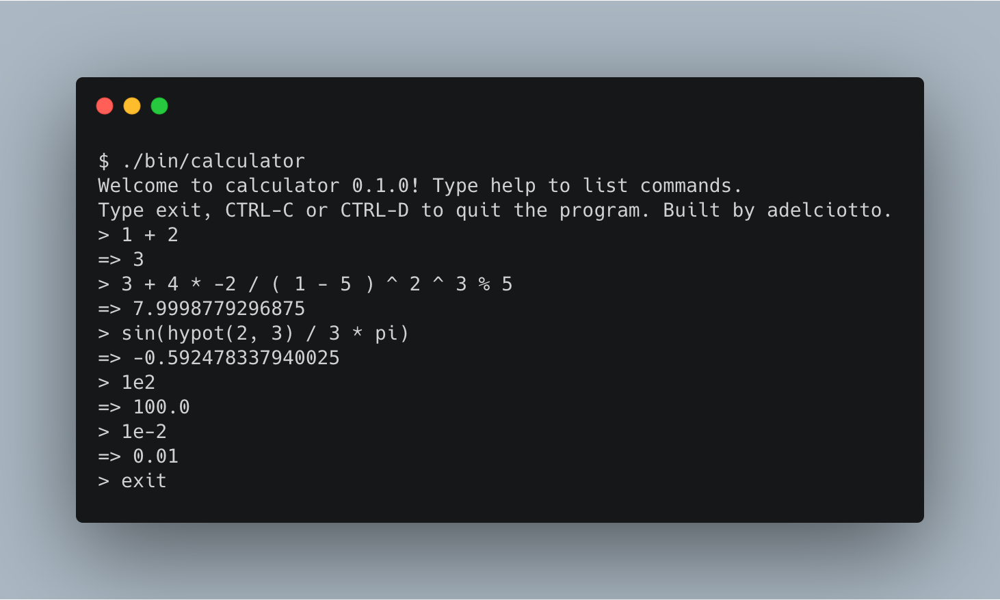
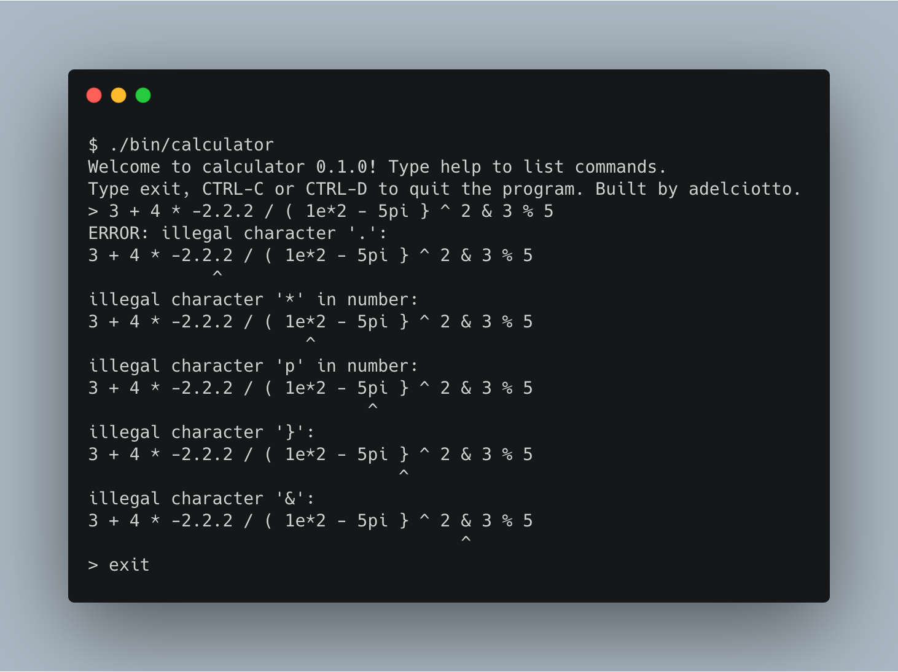

# Calculator

An interactive calculator written in Ruby for my own learning purposes. I use the Mac spotlight calculator a lot for random calculations, and I wanted to know how it works, so I built it.





## Features

The program provides a nice calculator REPL which supports the following features:

* Standard binary arithmetic operators
	* Addition `+`
	* Subtraction `-`
	* Multiplication `*`
	* Division `/` (always floating point division)
	* Power `^`
	* Modulus `%`
* Numbers in integer, decimal and scientific notation
* Minus unary operator (e.g `-5`)
* Mathematical functions (all that are provided by the Ruby `Math` module)
* Constants
	* pi
	* tau
	* e
* Error handling with messages showing where the error originated
* An interactive REPL that allows you to list all functions and constants

There is a TODO list with a bunch of things that will improve the program. You know the drill, more and better unit tests, some of the code can be simplified, implement some more math functions and other features, etc... It would be cool to finish the list, but, who knows if I'll ever get around to it. Time to move onto the next thing!

## Usage

Install the required gems

```
$ bundle install
```

Run the calculator

```
$ ./bin/calculator
```

## References

* https://en.wikipedia.org/wiki/Shunting-yard_algorithm
* https://en.wikipedia.org/wiki/Reverse_Polish_notation

## License

The gem is available as open source under the terms of the [MIT License](https://opensource.org/licenses/MIT).
